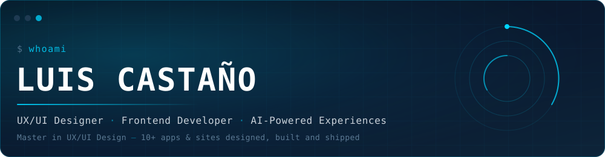
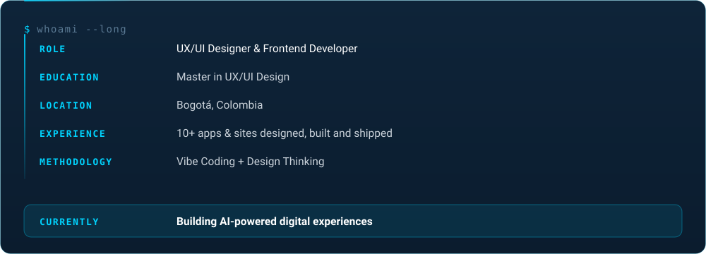
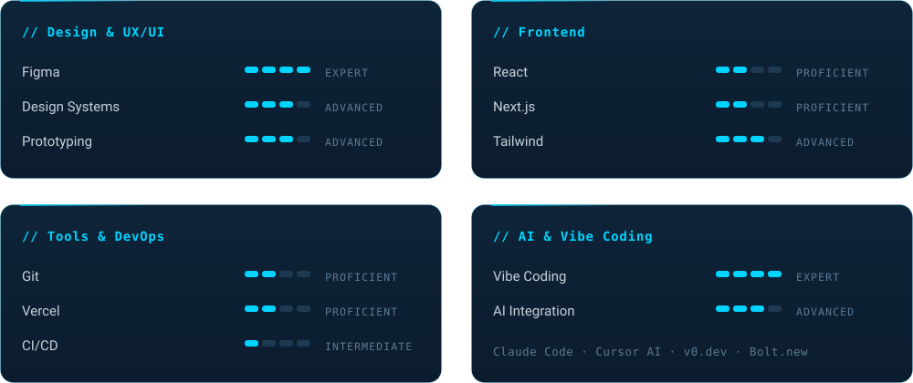
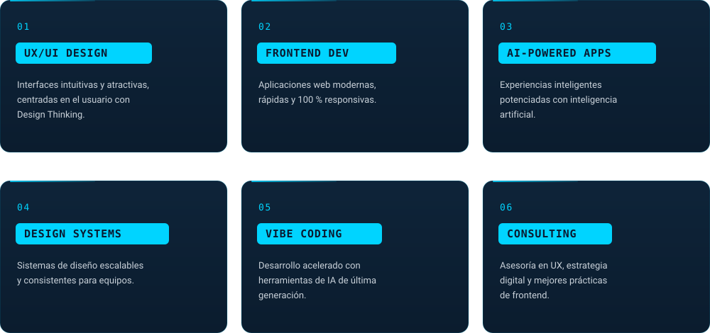

 

## 

 

## 

 

  

## 

 

## 

 

  

&nbsp;

 

## 

 

<picture>
  <source media="(prefers-color-scheme: dark)" srcset="https://raw.githubusercontent.com/castanoluisDev/castanoluisDev/output/github-snake-dark.svg"/>
  <source media="(prefers-color-scheme: light)" srcset="https://raw.githubusercontent.com/castanoluisDev/castanoluisDev/output/github-snake.svg"/>
  
</picture>

## 

 

 

&nbsp;

&nbsp;

  

  

